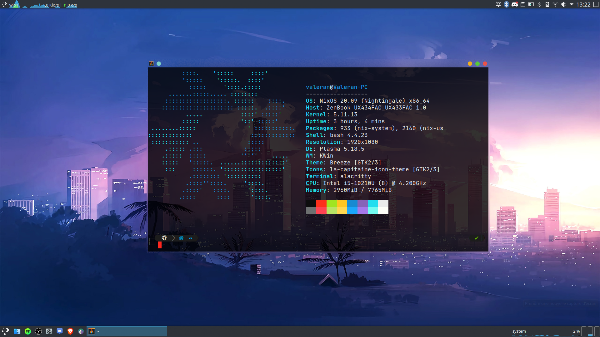
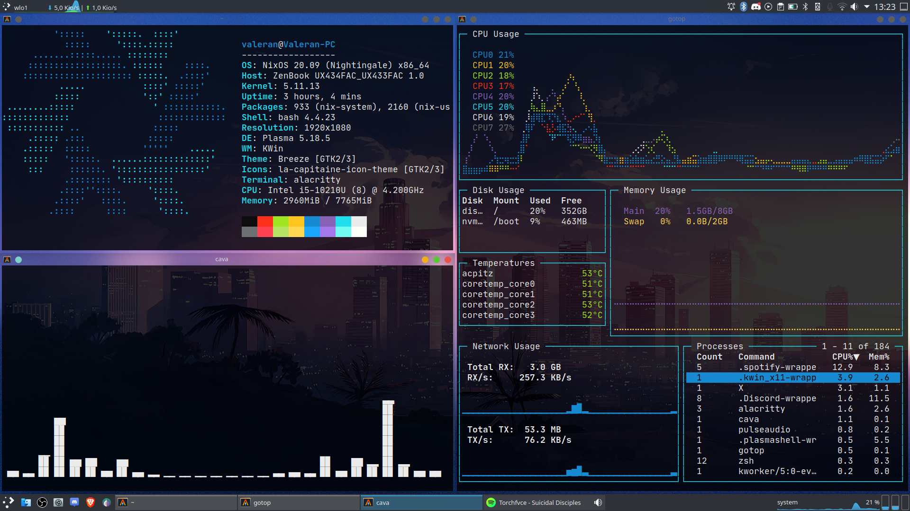
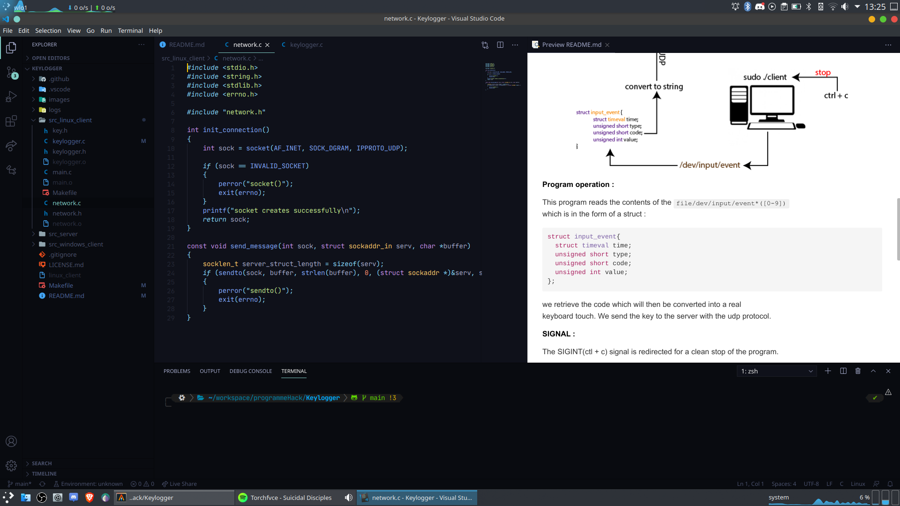

# zenbook-home-manger

See my configuration of nixos for my laptop.

I use two channels:

1. home-manager: https://github.com/nix-community/home-manager/archive/release-21.05.tar.gz
1. nixos: https://nixos.org/channels/nixos-unstable


### Screenshots





### How to use

```shell
cd~
git clone https://github.com/valoran-M/zenbook-home-manger.git .config/nixpkgs
home-manager switch
```

### Thanks

Thanks to [Thomas (a.k.a Th0rgal)](https://github.com/Th0rgal) for converting me to nixos, for the global config and especially for the zsh theme
